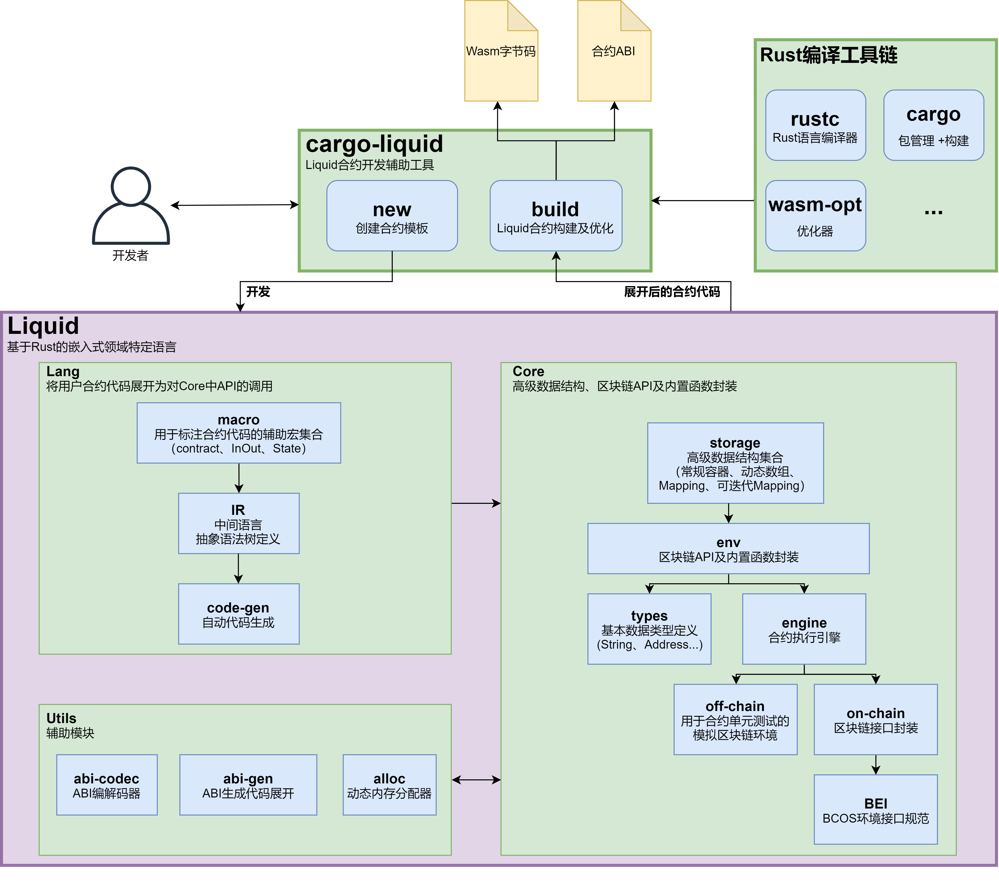

# Liquid架构设计

Liquid 及周边开发工具的整体架构如下图所示：

    

在整体架构中，`cargo-liquid`是面向开发者的命令行辅助工具，帮助开发者创建及构建 Liquid 项目。在项目创建阶段，`cargo-liquid`能够根据用户选定的项目类型根据模板自动配置编译选项及外部依赖，并生成 ABI 生成器等辅助代码；在项目构建阶段，`cargo-liquid` 负责收集编译元信息并进行跨平台构建，将 Liquid 项目编译为 Wasm 格式字节码。基本构建完成后，`cargo-liquid` 还会使用 Tree-Shaking 算法及 wasm-opt 等工具对生成的字节码进行效率和体积上的进一步优化。

**Lang**组件主要包括开发者在合约开发过程中所使用到的 `contract` 过程宏（用于以 `mod` 语法声明智能合约）、`InOut` 派生宏（用于以 `struct` 语法定义结构体参数类型）等，这些宏均由**macro**模块定义并导出。当构建 Liquid 项目时，Rust 语言编译器会对这些宏进行模式匹配并展开。在宏的展开过程中，IR 模块会解析开发者的代码并重新生成 AST，以对部分 Rust 语法进行重新诠释。随后，**code-gen**模块会依据 IR 模块生成的 AST 生成调用 Core 模块中的区块链底层接口封装，展开后的代码对开发者完全透明。

**Core**组件包含了开发者能够使用的区块链底层功能的实现。以自底向上的视角来看，**engine**模块是 Liquid 智能合约的执行引擎，为合约运行提供了最为坚实的基础。对于上层，**engine**模块提供了一系列基础 API，包括用于读取链上存储的 `get_storage` 接口、用于写入链上存储的 `set_storage` 接口、用于获取当前区块时间戳的 `now` 接口等。对于这些接口，**engine**有两种版本的实现：**off-chain**版本用于在本机执行智能合约的单元测试时使用，其内部模拟了区块链特性（键值对存储、事件记录器等）并提供了测试专用的接口，用于开发者在正式部署合约前测试合约逻辑是否正确；**on-chain**版本用于智能合约在真正地区块链环境中执行时使用，其实现相对较为简单，因为具体实现是由区块链底层平台完成，**on-chain**中只负责对这些接口进行声明并适配即可。

区块链底层接口的规范（名称、参数类型、返回值类型等）由区块链底层平台给出，对于 FISCO BCOS，这个规范称为 FISCO BCOS 环境接口规范（FISCO BCOS Environment Interface，FBEI）。理论上，只要接口规范确定且底层能够提供对应的支持，Liquid 也能够对接其他区块链平台，从而做到“一处编译，处处运行”。

**Core**组件中的**types**模块提供了智能合约中基本数据类型的定义，如地址（`address`）、字符串（`String`）等。**types**模块与**engine**模块一同构成了智能合约的执行环境，即**env**模块。**storage**模块基于**env**模块提供接口，对链上状态的访问方式进行了进一步的抽象。智能合约需要通过**storage**模块提供的容器类型读写链上状态。若要访问简单合约状态，则可以使用常规容器`Value`；若要以下标的形式序列式地访问合约状态，则可以使用向量容器`Vec`；若要以键值对的形式访问合约状态，则可以使用映射容器`Mapping`；若需要在`Mapping`的基础上根据键对合约状态进行迭代访问，则可以使用可迭代映射容器`IterableMapping`。

**Utils**组件则涵盖了其他基础功能。主要包括用于实现合约方法参数及返回值编解码的**abi-codec**模块——此模块是 Liquid 与 Solidity 合约进行通信的关键——以及用于生成 ABI 的**abi-gen**模块及用于内存分配的**alloc**。其中，**alloc**模块用于为合约注册为全局内存分配器，合约内所有的内存分配操作（动态数组、字符串等）都会通过**alloc**模块进行。
