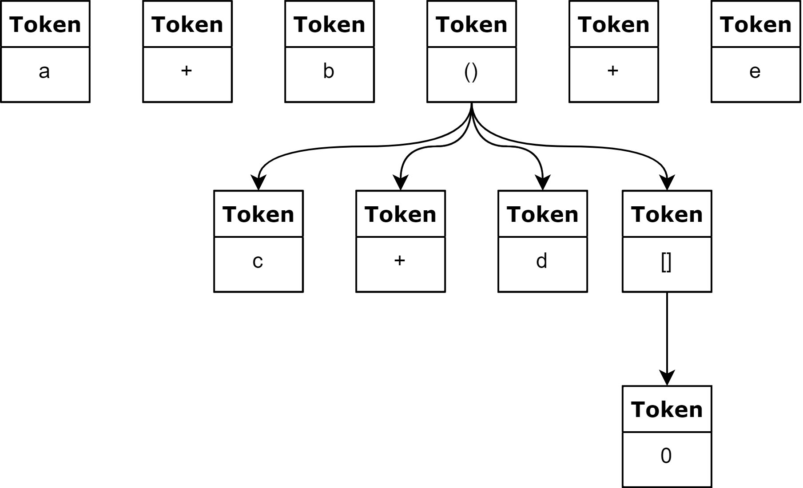
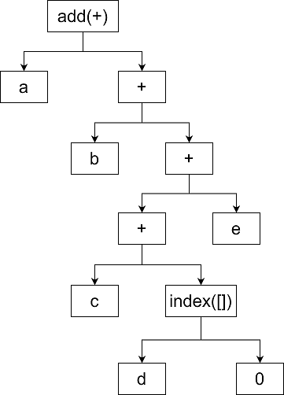

# 基于宏的元编程

为理解 Liquid 的实现原理，我们需要简单了解元编程与宏的概念。在[维基百科](https://zh.wikipedia.org/wiki/%E5%85%83%E7%BC%96%E7%A8%8B)中，元编程被描述成一种计算机程序可以将代码看待成数据的能力，使用元编程技术编写的程序能够像普通程序在运行时更新、替换变量那样操作更新、替换代码。宏在 Rust 语言中是一种功能，能够在编译实际代码之前按照自定义的规则展开原始代码，从而能够达到修改原始代码的目的。从元编程的角度理解，宏就是“生成代码的代码”，因而 Rust 语言中的元编程能力主要来自于宏系统。通过 Rust 语言的宏系统，不仅能够实现 C/C++语言的宏系统所提供的模式替换功能，甚至还能够控制编译器的行为、设计自己的语法从而实现 eDSL，而 Liquid 正是基于 Rust 语言的宏系统实现的 eDSL。我们接下来将对 Liquid 的工作机制进行简要介绍。

Rust 源代码文件编译需要经过下列阶段（图中省略了优化等步骤，因为它们并不涉及我们所讨论的主题）：

<div align=center>
    
</div>

1. 编译器在获得源代码文件后，会先进行词法分析，即把源代码字符序列转换为标记（Token）序列。标记是单独的语法单元，在 Rust 语言中，关键字、标识符都能够构成标记。词法分析还会将标记与标记的关系也记录下来，从而的生成标记树（Token tree），以一条简单的程序语句为例：

    ```rust
    a + b + (c + d[0])  + e
    ```

    其标记树如下图所示：
    <div align=center>
        
    </div>

    ```eval_rst
    .. admonition:: 注意

       与C/C++中宏处理（导入 ``#include`` 头文件、替换 ``#define`` 符号等）是发生在预编译阶段不同，Rust语言并没有预编译阶段，其宏展开是发生在的完成语法分析后。也正是因为如此，Rust宏能够获得更详细、更复杂的编译期信息，从而提供极为强大的元编程能力。
    ```

2. 随即，编译器启动语法分析流程，将词法分析生成的标记树翻译为 AST（Abstract Syntax Tree，抽象语法树）。在计算机科学中，AST 是源代码语法结构的一种抽象表示，能够方便地被编译器处理。它以树状的形式表现编程语言的语法结构，树上的每个节点都表示源代码中的一种结构。上述第 1 步中生成的样例标记树会被翻译为如下图所示的 AST：

 <div align=center>
     
 </div>

3. 然后，编译器开始分析 AST 并执行宏展开过程。此阶段是是最为重要的阶段，因为 Liquid 主要工作在这个阶段。以[HelloWorld 合约](../quickstart/example.html#hello-world)为例，编译器构造出 HelloWorld 合约的 AST 后，当扫描至 AST 中表示`#[liquid::contract]"`语句的语法树节点时，编译器能够知道，此处正在调用[属性宏](https://doc.rust-lang.org/reference/procedural-macros.html#attribute-macros)（Rust 中一种特殊的宏），因此会开始寻找`contract`属性宏的定义并尝试进行展开。在 Liquid 中，`contract`属性宏的定义如下：

    ```rust
    #[proc_macro_attribute]
    pub fn contract(attr: TokenStream, item: TokenStream) -> TokenStream {
        contract::generate(attr.into(), item.into()).into()
    }
    ```

    属性宏以函数形式定义，其输入是两个标记序列（TokenStream），其输出也是一个标记序列。事实上，在 Rust 语言中，宏可以理解为将某一个 AST 变换到另外一个 AST 的函数。Rust 编译器并不会向属性宏直接传递 AST，而且会将其调用位置所在的语法树节点转换为标记序列传递给属性宏，由属性宏的编写者自行决定如何处理这段标记序列。无论如何处理，属性宏都需要返回一段标记序列，Rust 编译器接收到这段标记序列后，会将其重新编译为 AST 并插入到宏的调用位置，从而完成代码的编译期修改。具体到 Liquid 的`contract`属性宏，当编译器进行展开时，`contract`属性宏会获取到自身及其后跟随的`mod`代码块（即我们用来定义合约状态及合约方法的模块）的标记序列，并将其解析为一棵 AST。随后，`contract`属性宏会自顶向下扫描这棵 AST，当遇到使用`#[liquid(storage)]`属性标注的`struct`代码块时，会进行语法检查及代码变换，将对结构体成员的读写操作变换为对区块链链上状态读写接口的调用。同理，当合约代码中出现`#[liquid(methods)]`属性标注的`impl`代码块时，也会经历相似的代码变换过程，只是变换及桥接到区块链底层平台的方式不尽相同。

4. 编译器将经过宏展开之后的 AST 编译为可执行文件：若是需要在本地运行单元测试，则会将 AST 编译为本地操作系统及 CPU 所能识别的可执行文件；若是需要能够在链上部署运行，则会将 AST 编译为 Wasm 格式字节码。至此，合约的基本构建流程结束。

从上述实现原理中可以看出，Liquid 可以理解为是一种以 Rust 语言目标语言的编程语言。在编译器的广义定义中，编译器是一种能够将以某种编程语言（原始语言）书写的源代码转换成另一种编程语言（目标语言）的计算机程序，因此 Liquid 在一定程度上扮演了编译器的角色。通过屏蔽区块链的底层实现细节，智能合约的开发过程能够更加便利及自然。HelloWorld 合约的完全展开形态已放置于[Rust Playground](https://play.rust-lang.org/?version=stable&mode=debug&edition=2018&gist=a2ac3d836b0fdce414e656019b454c82)，供有兴趣的读者参考学习。
