# 简介

可编程分布式协作（Programmable Distributed Collaboration，PDC）是⼀种建立在传统智能合约基础上的新编程范式，其本身是一种特殊的智能合约，能够对现代商业行为中的多方协作场景进行模拟。

纵览现代商业文明的发展历程可以发现，**合同**在建立市场信任基础的过程中发挥着极为重要的作用。合同用于规定利益相关方在权利与义务方面的依存关系，下图展示了简化版购买行为中基于合同的交互过程：

    

假设购买方 Alice 以借据合同（I Own U，IOU）的形式持有一笔由银行发行的数字资产（可以类比为现实中的货币，因为货币的本质是一种特殊的负债 <a href="https://www.bankofengland.co.uk/-/media/boe/files/quarterly-bulletin/2014/money-in-the-modern-economy-an-introduction.pdf?la=en&hash=E43CDFDBB5A23D672F4D09B13DF135E6715EEDAC">1</a> ），并希望购买某商品。此时出售方 Bob 以合同的形式向 Alice 发起一项提议： Alice 可使用她的 IOU 来交换 Bob 的商品。稍后，Alice 接受这份提议，将 IOU 的所有权转移至 Bob，同时 Bob 承诺将商品交接给 Alice。

在上述过程中，接受提议的行为可以理解为 Alice 行使了她在提议合同所赋予她的选择权，同时该行为产生了两个结果。首先，Alice 将她的 IOU 转移给 Bob，实际上也是在行使 IOU 所赋予 Alice 转移所有权的权利，同时该 IOU 的内容作废、属于 Bob 的新 IOU 被创建出来；其次，创建了一份新的采购合同，合同记录了 Alice 和 Bob 对协作内容无异议（Bob 是主动发起提议、Alice 是主动接受提议，双发均是在自愿的情况下达成一致），并规定之后 Bob 必须将商品移交给 Alice。

上述流程虽然较为简单，但是已经引入了 PDC 中大部分的概念，这其中包括：

-   **参与方（Party）**：参与协作过程的主体，例如示例中的银行、Alice 及 Bob；

-   **合同（Contract）**：在协作过程中，记录各参与方之间所达成的共识的载体，例如示例中的 IOU 及最终的采购合同。每份合同至少需要有一名**签署方（Signer）**。只有在取得所有签署方一致同意后，合同才能被<strong>创建（Create）</strong>，例如在没有授权的情况下，Charlie 无法代替 Alice 去与 Bob 达成采购协议；

-   **权利（Right）**：合同赋予参与方<strong>行使（Exercise）</strong>一定行为以实现某种利益的资格，例如示例中 Alice 能够转移 IOU 的所属权。任何权利只能被已授权的参与方行使，例如在没有授权的情况下，Charlie 无法去花费 Alice 的 IOU。

多个签署合同、行使权利的动作按照某种逻辑前后衔接起来，便可以组成能够完成多方协作任务的工作流。区块链所蕴含的分布式、不可篡改和协同共识的技术特性使得它天然适合涉及协同工作的领域，而 PDC 则力图为开发者提供开发这类应用的脚手架。在 PDC 中，参与协作的实体可以使用链上唯一的账户地址表示；同时，PDC 将合同内容与行使权利分别抽象为数据状态及对数据状态的修改，并提供专有语法描述权利分配。通过将涉及协作过程的概念可编程化，开发者能够通过 PDC 直接描述合同、签署、权利、授权等概念，因此开发者能够更加专注于业务逻辑的实现，而无需拘泥于如何实现合同创建及权限检查等内部细节。
